!!Work In Progress!!

宋昭大佬已经在 [MariaDB vector index 实现分析](https://zhuanlan.zhihu.com/p/1904733400474054912) 用通俗易懂的语言描述了 mariadb 的 vector index 实现原理，以及性能分析。

通过这篇文章，我们知道了：
1. 向量索引是在 Server 层实现的，innodb 不感知
2. 向量索引对应一张内部表
3. 向量类型内部其实是 varchar

内部表：

```sql
CREATE TABLE `用户表表名 + #i# + vector列位置` (
  layer tinyint not null, -- 层数
  tref varbinary(%u), -- 用户表的主键值，用于内部表记录与对应用户表记录的关联
  vec blob not null, -- 向量数据，与主表存储方式不同
  neighbors blob not null, -- 该节点在每一层的邻居，存的是 DB_ROW_ID
  unique (tref),
  key (layer)
)
```


另外需要补充的是：
mariadb 的向量索引基于 hnsw 算法，并做了修改。关于 hnsw 可以参考我之前的博客「HNSW 索引实现（faiss）」。

在开始阅读本文之前，请先考虑几个问题：
1. hnsw 是面向纯内存设计的数据结构，用表保存 hnsw 之后，会涉及到磁盘 io。那么如何应对 hnsw 的随机读问题，mariadb 有没有相应的优化？
2. mariadb 是如何保证事务的？回滚时如何撤销对 hnsw 的修改？

本文着重于源码实现，基于 mariadb 11.8 版本，并从代码中找寻这些问题的答案。

## 数据类型

用户使用 `VECTOR` 关键字指定向量数据类型，如下所示：

```sql
VECTOR(N)
```


用法示例：

```sql
CREATE TABLE products (
    name varchar(128),
    description varchar(2000),
    embedding VECTOR(4) NOT NULL,
    VECTOR INDEX (embedding) M=6 DISTANCE=euclidean
);

INSERT INTO products (name, description, embedding)
VALUES ('Coffee Machine',
        'Built to make the best coffee you can imagine',
        VEC_FromText('[0.3, 0.5, 0.2, 0.1]'))
```

### 实现原理

对外显示 vector 数据类型，但在内部，mariadb 使用 varchar 存储数据。

mariadb 使用 udt 机制来扩展支持 vector 类型。

当往 vector 列插入数据时，需要通过 `VEC_FromText` 函数将向量数据转换为 varchar 数据：其工作原理是将向量数据当作 json 的数组进行解析，对于 json array 的每一项，使用 `strntod` 将字符串转为 `float`，再通过 `float4store` 转为4字节二进制，最终将这些二进制 append 到一起。所以，`vector(n)` 占用的空间为 `n * 4` 字节。

### 代码分析

vector 匹配的语法规则如下所示：

```c++
udt_name float_options srid_option
{
  if (Lex->set_field_type_udt(&$$, $1, $2))
    MYSQL_YYABORT;
}
```

`set_field_type_udt` 中能够识别并返回 `type_handler_vector` 实例，这是一个全局变量，类型为 `Type_handler_vector`，处理 vector 类型。

在建表流程中，会调用到 `Type_handler` 的 `make_table_field_from_def` 接口完成转换，将 Type_handler 转换为 Filed，vector 类型对应的类型为 `Field_vector`。Field 中保存了 server 层和存储层数据交互的桥梁： `uchar		*ptr;` 指针，通过 Field 的 `store` 方法，可以将数据保存在 ptr 所指向的内存中，并交给存储引擎。

Field_vector 是 Field_varstring 的子类，其 store 方法会最终调用 Field_varstring 的 store 方法。

Field_vector 只实现了接收 `const char *` 的 store 方法。在往 vector 类型插入数据前，必须要调用 `VEC_FromText` 函数将向量数据转换为二进制表示方式。

`VEC_FromText` 对应的类为：`Item_func_vec_fromtext`，其 val_str 完成将向量类型字面值转换为二进制，之后调用 Field_vector 的 store 函数存入 ptr 中。

## 向量索引

### 索引创建流程

mariadb 新增了 high level index（hlindex）机制，来支持创建向量索引。通过在建表流程（对应 `ha_create_table` 函数）中增加对 hlindex 的处理，完成创建内部表的逻辑。


#### 源码分析

hlindex 的判断逻辑：

```c++
uint hlindexes() { return total_keys - keys; }
```

- total_keys：表示创建表时指定的所有索引的数目，包含 hlindex，目前 hlindex 就是指向量索引
- keys：存储引擎上创建的索引数目

在 ha_create_table 的最后，如果检测到表上含有 hlindex，就会创建内部表，步骤如下：

```c++
ha_create_table {
    // ... 正常的建表流程
    if (share.hlindexes()) {
        1. init_tmp_table_share // 初始化临时 index_share
        2. mhnsw_hlindex_table_def // 取回建表语句
        3. index_share.init_from_sql_statement_string // 用建表语句创建来初始化 index_share
        4. ha_create_table_from_share // 创建临时表
    }
}
```

### hnsw 数据结构构建


#### FVectorNode

1 字节对齐：与表行记录中的二进制格式严格一一对应

```
00: [ctx ptr.......................] 8 bytes
08: [vec ptr.......................] 8 bytes
16: [neighbors ptr................] 8 bytes
24: [max_layer]                    1 byte
25: [stored|deleted bitfield]      1 byte
26: END
```

对比默认对齐方式：
```
00: [ctx ptr.......................] 8
08: [vec ptr.......................] 8
16: [neighbors ptr................] 8
24: [max_layer]                    1
25-27: [padding]                   3 bytes  <-- 对齐到 4
28-31: [bitfield (int)]            4 bytes
32: END (aligned to 8)
```

在往表中插入数据时，会构建 hnsw 索引，整体流程如下：

<!--  -->


插入重复的向量会怎么样？

从 insert 的流程来看，重复向量在内部会被视为独立的数据点，从内部表的定义也可以看出来：内部表采用了没有主键，内部使用 DB_ROW_ID 作为主键，也就是说相同的向量具有不同的 DB_ROW_ID。

### 更新

更新是怎么处理的？？

```c++
ha_update_row -> hlindexes_on_update --> mhnsw_invalidate
                                     `-> mhnsw_insert
```

采用标记删除，并且插入新的数据点。

### 删除

```c++
ha_delete_row -> mhnsw_invalidate

ha_truncate -> hlindexes_on_delete_all -> mhnsw_delete_all
```

清空向量索引时， truncate 效率比 delete 高。


### 索引查询

```sql
SELECT p.name, p.description
FROM products AS p
ORDER BY VEC_DISTANCE_EUCLIDEAN(p.embedding,
                      VEC_FromText('[0.3, 0,5, 0.1, 0.3]'))
LIMIT 10
```

我的理解是：mariadb 并没有很好的解决随机读的问题，或者说没有管这个问题。使用了缓存机制，包括 mhnsw 的 node_cache 和 innodb 的 buffer pool 机制来缓存数据，避免后续的磁盘 io，但并没有从本质上解决随机读问题。


node_cache 是的大小限制是软性的（在 hnsw shared ctx release时才会进行检查，超过限制，则会释放掉 node_cache），可能会导致 oom。


```c++
sub_select --> join_read_first -> hlindex_read_first -> mhnsw_read_first
           `-> read_record -> join_hlindex_read_next -> mhnsw_read_next
```


### 事务保证分析


`MHNSW_Trx` 是 non-shared 事务上下文，以单链表的形式存储在 thd->ha_data 中，每个 MHNSW_Trx 对应一张表：在事务中第一次往表中插入数据时创建，按照写表的顺序串成单链表（反向的，越后来的表越在前），thd->ha_data 保存的最近写的表的 MHNSW_Trx。

获取 `MHNSW_Share` 流程：

```mermaid
graph TD
    Start([开始: MHNSW_Share::acquire])
    GetGraph[获取图表: graph = table->hlindex]
    
    Start --> GetGraph
    GetGraph --> TrxEntry[调用 MHNSW_Trx::get_from_thd]
    
    %% 嵌入 get_from_thd 流程
    TrxEntry --> TrxCheck{has_transactions<br/>是否支持事务?}
    TrxCheck -->|否| TrxRetNull1[返回 NULL]
    TrxCheck -->|是| TrxGetData[从 THD 获取事务:<br/>thd_get_ha_data]
    
    TrxGetData --> TrxCheckForUpdate{for_update=false<br/>且 trx=NULL?}
    TrxCheckForUpdate -->|是| TrxRetNull2[返回 NULL]
    TrxCheckForUpdate -->|否| TrxFindLoop{循环查找:<br/>匹配 table_id?}
    
    TrxFindLoop -->|找到| TrxIncrRef[增加引用计数:<br/>trx->refcnt++]
    TrxFindLoop -->|未找到| TrxCreate[创建新事务:<br/>new MHNSW_Trx]
    
    TrxCreate --> TrxLink[链接到事务链表:<br/>trx->next = 旧链表头]
    TrxLink --> TrxSetData[设置到 THD:<br/>thd_set_ha_data]
    TrxSetData --> TrxCheckFirst{是否首个事务?}
    
    TrxCheckFirst -->|否| TrxIncrRef
    TrxCheckFirst -->|是| TrxCheckExplicit{是否显式事务?}
    
    TrxCheckExplicit -->|是| TrxRegConn[注册到连接级事务:<br/>trans_register_ha true]
    TrxCheckExplicit -->|否| TrxRegStmt[注册到语句级事务:<br/>trans_register_ha false]
    TrxRegConn --> TrxRegStmt
    
    TrxRegStmt --> TrxIncrRef
    TrxIncrRef --> TrxReturn[返回 trx]
    
    %% 返回主流程
    TrxRetNull1 --> ShareEntry[调用 MHNSW_Share::get_from_share]
    TrxRetNull2 --> ShareEntry
    TrxReturn --> CheckHasTrans
    
    %% 嵌入 get_from_share 流程
    ShareEntry --> ShareLock[锁定 share:<br/>share->lock_share]
    ShareLock --> ShareGetCtx[获取上下文:<br/>share->hlindex->hlindex_data]
    ShareGetCtx --> ShareCheckCtx{ctx 存在?}
    
    ShareCheckCtx -->|否且 table 非空| ShareCreate[创建新上下文:<br/>new MHNSW_Share]
    ShareCheckCtx -->|是| ShareIncrRef2
    
    ShareCreate --> ShareCheckCreate{创建成功?}
    ShareCheckCreate -->|否| ShareUnlock
    ShareCheckCreate -->|是| ShareSave[保存到 share:<br/>hlindex_data = ctx]
    
    ShareSave --> ShareIncrRef1[增加引用计数]
    ShareIncrRef1 --> ShareIncrRef2[增加引用计数:<br/>ctx->refcnt++]
    
    ShareIncrRef2 --> ShareCheckTable{table 非空?}
    ShareCheckTable -->|是| ShareSetStat[设置统计信息:<br/>used_stat_records]
    ShareCheckTable -->|否| ShareUnlock
    ShareSetStat --> ShareUnlock[解锁 share:<br/>share->unlock_share]
    ShareUnlock --> ShareReturn[返回 ctx]
    
    %% 继续主流程
    ShareReturn --> CheckHasTrans{table->file->has_transactions<br/>是否支持事务?}
    
    CheckHasTrans -->|是| AcquireLock[获取读锁:<br/>mysql_rwlock_rdlock commit_lock]
    CheckHasTrans -->|否| CheckStart
    AcquireLock --> CheckStart
    
    CheckStart{ctx->start<br/>是否已加载?}
    CheckStart -->|是| ReturnSuccess([返回 0: 成功])
    CheckStart -->|否| InitIndex[初始化索引:<br/>ha_index_init IDX_LAYER, 1]
    
    InitIndex --> CheckInitErr{初始化<br/>是否出错?}
    CheckInitErr -->|是| ReturnErr1([返回错误码])
    CheckInitErr -->|否| GetLastNode[获取最后一个节点:<br/>ha_index_last]
    
    GetLastNode --> EndIndex[结束索引扫描:<br/>ha_index_end]
    EndIndex --> CheckLastErr{获取节点<br/>是否出错?}
    
    CheckLastErr -->|是| ReturnErr2([返回错误码<br/>如 137 表示图为空])
    CheckLastErr -->|否| GetPosition[获取记录位置:<br/>graph->file->position]
    
    GetPosition --> SetLengths[设置向量长度:<br/>ctx->set_lengths]
    SetLengths --> GetNode[获取节点:<br/>ctx->get_node]
    GetNode --> LoadNode[加载节点数据:<br/>node->load_from_record]
    
    LoadNode --> CheckLoadErr{加载<br/>是否出错?}
    CheckLoadErr -->|是| ReturnErr3([返回错误码])
    CheckLoadErr -->|否| SetStart[设置起始节点:<br/>ctx->start = node]
    SetStart --> ReturnSuccess

    style Start fill:#4A90E2,stroke:#2E5C8A,stroke-width:3px,color:#fff
    style TrxEntry fill:#FFB84D,stroke:#CC8A26,stroke-width:2px
    style ShareEntry fill:#9B59B6,stroke:#6C3483,stroke-width:2px,color:#fff
    style ReturnSuccess fill:#27AE60,stroke:#1E8449,stroke-width:3px,color:#fff
    style ReturnErr1 fill:#E74C3C,stroke:#C0392B,stroke-width:2px,color:#fff
    style ReturnErr2 fill:#E74C3C,stroke:#C0392B,stroke-width:2px,color:#fff
    style ReturnErr3 fill:#E74C3C,stroke:#C0392B,stroke-width:2px,color:#fff
    style TrxRetNull1 fill:#F39C12,stroke:#D68910,stroke-width:2px
    style TrxRetNull2 fill:#F39C12,stroke:#D68910,stroke-width:2px
    style TrxReturn fill:#58D68D,stroke:#28B463,stroke-width:2px
    style ShareReturn fill:#58D68D,stroke:#28B463,stroke-width:2px
    style TrxCheck fill:#FFE5CC,stroke:#FF9933,stroke-width:2px
    style ShareCheckCtx fill:#E8DAEF,stroke:#9B59B6,stroke-width:2px
    style CheckStart fill:#AED6F1,stroke:#3498DB,stroke-width:2px
    style CheckHasTrans fill:#AED6F1,stroke:#3498DB,stroke-width:2px
```




当


如何支持处理写写冲突，读写冲突的？

插入：

从 thd 中获取不到的时候，会新建一个 MHNSW_Share，读取不会。MHNSW_Share 中会保存 entrypoint。

读取：

从 thd 中获取不到的时候，不会新建；接着尝试从 TABLE_SHARE 中获取，如果再获取不到，会新建，并保存到 TABLE_SHARE 中。


主要是利用 innodb 的事务来实现的。


提交：

```c++
ha_commit_trans -> ha_commit_one_phase -> commit_one_phase_2 -> MHNSW_Trx::do_commit
```


如何回滚的？


### 崩溃恢复

挂了以后的恢复流程

会不会丢数据？


## 性能

## 参考资料
1. [MariaDB vector index 实现分析](https://zhuanlan.zhihu.com/p/1904733400474054912)
2. [How Fast Is MariaDB Vector?](https://mariadb.com/resources/blog/how-fast-is-mariadb-vector/)
